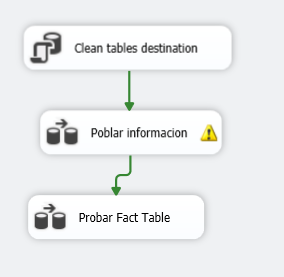
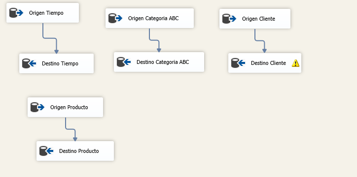
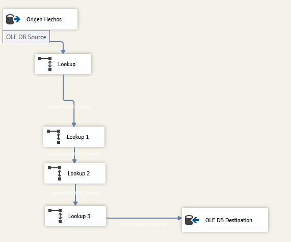
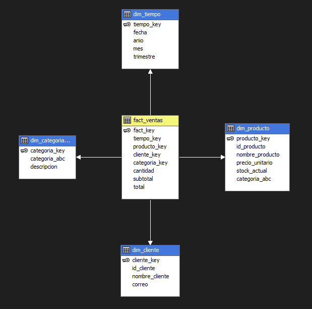

# Proyecto ETL con SSIS y Cubo OLAP

## 1. Flujo de Control en SSIS

## 2. Flujo de Datos en SSIS

## 3. Proceso de Poblado de la Tabla de Hechos

## 4. Modelo Dimensional (Esquema en Estrella)

